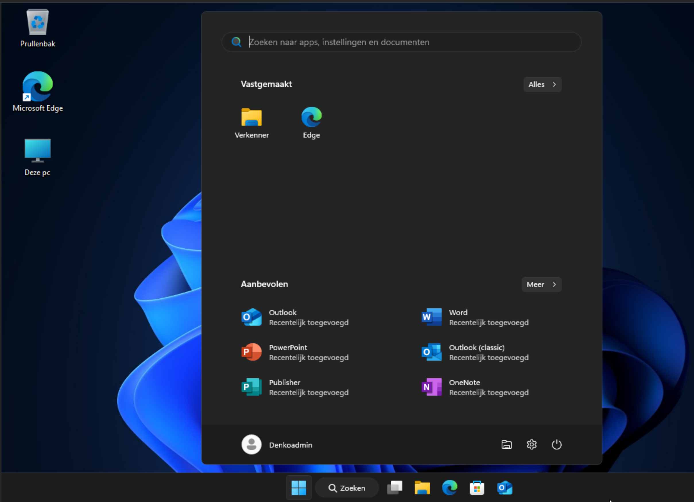

# Modern Device Deployment - Denko-ICT

	

## Why this project exists
This repository is the centerpiece of my internship at Denko ICT. I joined a team where many device deployments and configuration tasks were still performed manually. I got the opportunity to re-evaluate these processes. By building a more modern automation toolkit, I want to prove that Windows 11 Pro devices can be deployed, secured, and made productive faster and with fewer errors, without relying on legacy tooling.

## What this repository delivers
- A PowerShell 7 automation that aligns with current Microsoft endpoint management guidance.
- Zero reliance on deprecated stacks such as Microsoft MDT, classic batch/CMD scripts, VBScript, PowerShell 2.0, or WMIC.
- Integrated vendor tooling for Dell (Dell Command | Update CLI) and HP (HP Image Assistant & HP Client Management Script Library (HP CMSL)) so devices install patches out of the box via Windows Terminal.
- Reusable scripts for application deployment, driver management, device preparation, and general maintenance.
- Documentation to help colleagues adopt the same modern approach inside and outside Denko ICT.

## Guiding principles
- **Modern only:** Everything targets Windows 11 Pro 25H2 with full support for PowerShell 7 and Windows Terminal.
- **Automate first:** Every manual task I encountered during the internship is captured as code or a repeatable script.
- **Vendor-aware:** Dell and HP enterprise devices are the current focus because they represent our production fleet.
- **Best practices aligned:** Each script adopts current recommendations from Microsoft, Dell, and HP for endpoint configuration and lifecycle management.

## Hybrid deployment approach
- **Microsoft Intune & AutoPilot:** A portion of our fleet is provisioned through Windows AutoPilot, letting Intune apply baseline policies, applications, and compliance rules. The scripts in this repository extend those baselines with richer post-enrollment automation, still running in PowerShell 7.
- **On-premises enrollment:** Another slice of devices is prepared on local infrastructure. Even without cloud enrollment, these systems benefit from the same modern PowerShell 7 tooling to eliminate manual steps.
- **Shared automation layer:** Whether cloud-managed or on-premises, administrators can orchestrate consistent build, patch, and configuration routines from a single toolkit.

## Repository structure
| Folder/File | Purpose |
| --- | --- |
| `autounattend.xml` | Baseline unattend configuration for Windows 11 Pro imaging scenarios. |
| `Scripts/ps_Custom-Functions.ps1` | Primary entry point that loads the toolkit into memory for administrators. |
| `Scripts/ps_Install-Applications.ps1` | Automates application installation using winget and official installers. |
| `Scripts/ps_Install-Drivers.ps1` | Handles driver deployment leveraging HP CMSL and Dell DCU-CLI. |
| `Scripts/ps_Remove-Bloat.ps1` | Removes unnecessary Windows, OEM and consumer applications from managed devices. This script helps to declutter the user experience and improve system performance. |
| `Scripts/ps_Update-AllApps.ps1` | Forces application updates to deliver a fully patched experience. Can be run manually to ensure all apps are up to date. |

> Explore the `Scripts` directory for scripts covering setting hostname based on serial number, wallpaper configuration, Microsoft 365 installation, and more.

## Compatibility 🧪

### Windows 11 validation
| Version | Status | Notes |
| --- | --- | --- |
| 25H2 | ✅ Tested | Primary release; all workflows validated and deemed functional. |
| 24H2 | 🕒 Legacy | Supported for now, but the focus is on 25H2. |
| 23H2 | ❌ Unsupported | Cannot be guaranteed to work, since this OS is no longer maintained by Microsoft. |

### Hardware and scope
| Device | Status | Notes |
| --- | --- | --- |
| HP ProBook G9 and higher | ✅ Passed | Fully automated deployment with HP CMSL & HPIA. |
| HP EliteBook G9 and higher | ✅ Passed | Fully automated deployment with HP CMSL & HPIA. |
| HP ZBook G9 and higher | ✅ Passed | Fully automated deployment with HP CMSL & HPIA. |
| Dell Latitude 5000 series | ✅ Passed | Fully automated deployment with Dell Command \| Update CLI. |
| Dell Latitude 7000 series | ✅ Passed | Fully automated deployment with Dell Command \| Update CLI. |
| Dell Latitude 9000 series | ✅ Passed | Fully automated deployment with Dell Command \| Update CLI. |
| Dell OptiPlex 3000 series | ✅ Passed | Fully automated deployment with Dell Command \| Update CLI. |
| Dell OptiPlex 5000 series | ✅ Passed | Fully automated deployment with Dell Command \| Update CLI. |
| Dell OptiPlex 7000 series | ✅ Passed | Fully automated deployment with Dell Command \| Update CLI. |
| Dell OptiPlex Micro | ✅ Passed | Fully automated deployment with Dell Command \| Update CLI. |
| Dell OptiPlex Tower | ✅ Passed | Fully automated deployment with Dell Command \| Update CLI. |
| Dell OptiPlex Small Form Factor | ✅ Passed | Fully automated deployment with Dell Command \| Update CLI. |
| Dell OptiPlex All-In-One | ✅ Passed | Fully automated deployment with Dell Command \| Update CLI. |
| Dell Precision 3000 series | ✅ Passed | Fully automated deployment with Dell Command \| Update CLI. |
| HP ProBook 460 G11        | ✅ Passed | Fully automated deployment with HP CMSL \ HPIA. |
| Dell Latitude 5440        | ✅ Passed | Fully automated deployment with Dell DCU-CLI.   |

## Customizing and usage
1. Install [PowerShell 7](https://learn.microsoft.com/powershell/scripting/install/installing-powershell) and run scripts from Windows Terminal.
2. Clone this repository and review the scripts relevant to your deployment scenario.
3. Customize scripts as needed
4. Customize the autounattend.xml as desired

## Execution
1. Create a bootable USB drive with Windows 11 Pro 25H2 (e.g., via the [Media Creation Tool](https://www.microsoft.com/software-download/windows11)).
2. Place the autounattend.xml in the root of the USB drive.
3. Boot the target computer from the USB drive and follow the automated installation.

> All scripts are designed to run without the need for Microsoft Deployment Toolkit, batch files, CMD, VBScript, PowerShell 2.0, or WMIC.

## Roadmap and contributions
- Add optional Intune scripts/templates for hybrid environments.
- Build towards integration patterns with KaseyaOne and other RMM platforms and document them.

Feedback, feature requests, and pull requests are welcome. Please [open an issue](https://github.com/Stensel8/DenkoICT/issues) to start. You can also ping me.

## License
This project is distributed under the terms of the [MIT License](LICENSE). This is a license also used by many of my sources of inspiration.

## References and inspiration

### Primary contributors
These repositories and users shaped large parts of the automation logic:
- https://github.com/stensel8/pchealth
- https://github.com/realsdeals/
- https://github.com/jeffdfield
- https://github.com/FriendsOfMDT/PSD
- https://github.com/ChrisTitusTech/winutil
- https://github.com/KelvinTegelaar/RunAsUser

### Additional references
- https://www.smartdeploy.com/download/trial-guide/
- https://docs.microsoft.com/en-us/windows/deployment/windows-deployment-scenarios
- https://github.com/FriendsOfMDT/PSD
- https://learn.microsoft.com/en-us/intune/configmgr/mdt/
- https://www.microsoft.com/en-us/download/details.aspx?id=54259
- https://github.com/Stensel8/Intune-Deployment-Tool
- https://github.com/rink-turksma/IntunePrepTool
- https://uupdump.net/
- https://2pintsoftware.com/products/deployr
- https://www.immy.bot/
- https://github.com/Romanitho/Winget-Install
- https://github.com/ChrisTitusTech/winutil
- https://api.github.com/repos/microsoft/winget-cli/releases/latest
- https://github.com/KelvinTegelaar/RunAsUser
- https://github.com/asheroto/winget-install
- https://www.powershellgallery.com/packages/winget-install/
- https://www.powershellgallery.com/packages/HPCMSL/
- https://github.com/omaha-consulting/winstall
- https://github.com/omaha-consulting/winget.pro
- https://github.com/REALSDEALS/pcHealth
- https://github.com/REALSDEALS/pcHealthPlus-VS
- https://github.com/REALSDEALS/pcHealthPlus

### Microsoft ecosystem partners
- https://learn.robopack.com/home
- https://www.rimo3.com/ms-intune-migration
- https://winstall.app/
- https://winget.pro/