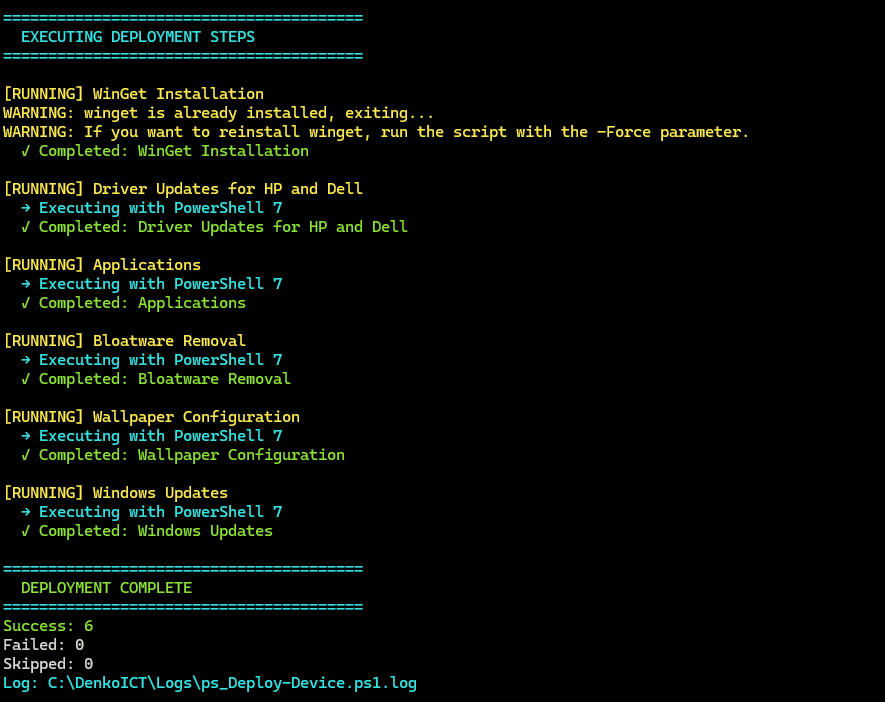

# Windows 11 Pro Deployment Automation

<p align="left">
	<a href="README.nl.md">
		
	</a>
</p>

[](https://github.com/Stensel8/DenkoICT/actions/workflows/dependabot/dependabot-updates)

[](https://github.com/Stensel8/DenkoICT/actions/workflows/devskim.yml)

[](https://github.com/Stensel8/DenkoICT/actions/workflows/powershell.yml)

Automated Windows 11 Pro deployment tools. No manual clicking. Uses PowerShell 2.0 in WinPE, PowerShell 5.1 to bootstrap PowerShell 7, then PowerShell 7 for the actual deployment. Uses modern tools where possible.




## What You Get

- Zero-touch Windows 11 deployment via USB boot
- Automatic driver updates (Dell DCU-CLI, HP IA)
- WinGet application deployment with retry logic
- Registry-based progress tracking that survives crashes
- Deployment continues when individual steps fail
- RMM agent installation (Datto, etc.)

## Quick Start

**Prerequisites:** Windows 11 Pro 25H2, **Ethernet connection** (required for script downloads)

1. **Create bootable USB:**
   - **Option A:** [Windows Media Creation Tool](https://www.microsoft.com/software-download/windows11) (recommended)
   - **Option B:** [Rufus](https://rufus.ie/) - **Don't check the final customization boxes** as they will overwrite our `autounattend.xml`
   - **Best results:** Use a clean Windows 11 Pro 25H2 image
   - **Optional:** Pre-load RST/RAID drivers into boot.wim to ensure all drives are available
2. **Copy files to USB root:**
   - `autounattend.xml` 
   - Your RMM agent (name it `Agent.exe` for best results)
3. **Boot target device from USB** with Ethernet cable connected
4. **Wait** - Everything happens automatically
5. **USB removal timing:**
   - **Keep USB connected** through the first reboot (hostname change)
   - **Safe to remove** after 2+ reboots when progress shows >64% (black screen phase)
   - **If no RMM agent:** USB can be removed anytime after first reboot

Without Ethernet, only the base Windows install with hostname change happens.

## How It Works

**PowerShell version:**
- **Windows PE**: PowerShell 2.0 during setup (inside autounattend.xml)
- **First Boot**: PowerShell 5.1 downloads and installs PowerShell 7  
- **Deployment**: PowerShell 7 runs all deployment scripts

1. `autounattend.xml` configures Windows, copies RMM agent from USB to `C:\DenkoICT\Download\Agent.exe`
2. Hostname changes to `PC-{SerialNumber}`, system reboots  
3. `ps_Init-Deployment.ps1` runs on first login (PowerShell 5.1)
4. Installs WinGet and PowerShell 7, then launches `ps_Deploy-Device.ps1`
5. Each deployment step tracked in `HKLM:\SOFTWARE\DenkoICT\Deployment\Steps`

**Steps executed:**
- WinGet installation
- Driver updates (vendor-specific tools)
- Application bundle via WinGet
- Bloatware removal
- Windows Updates
- RMM agent installation

If something fails, deployment continues. Check `C:\DenkoICT\Logs` for detailed status and registry for summary.

## Key Scripts

| Script | What It Does |
| --- | --- |
| [ps_Init-Deployment.ps1](Scripts/ps_Init-Deployment.ps1) | **Bootstrapper** - Installs WinGet + PS7, launches main deployment |
| [ps_Deploy-Device.ps1](Scripts/ps_Deploy-Device.ps1) | Main orchestrator - runs everything in PowerShell 7 |
| [ps_Custom-Functions.ps1](Scripts/ps_Custom-Functions.ps1) | Function library - logging, network tests, exit codes |
| [ps_Install-Winget.ps1](Scripts/ps_Install-Winget.ps1) | Installs WinGet with fallback methods |
| [ps_Install-Applications.ps1](Scripts/ps_Install-Applications.ps1) | WinGet app deployment |
| [ps_Install-Drivers.ps1](Scripts/ps_Install-Drivers.ps1) | Dell DCU-CLI / HP IA driver updates |

## Usage Examples

**Deploy everything:**
```powershell
.\ps_Init-Deployment.ps1
```

**Install specific apps (after initialization):**
```powershell
.\ps_Install-Applications.ps1 -Applications @("Microsoft.PowerShell", "7zip.7zip")
```


## RMM Setup

Put your RMM agent installer on the USB drive. **Name it `Agent.exe`** for zero hassle. 

During Windows setup, `autounattend.xml` searches for files matching `*Agent*.exe`, `*RMM*.exe`, etc., and copies the first one found to `C:\DenkoICT\Download\Agent.exe`. After reboot, deployment script installs it automatically.

**Supported agents:** Anything with silent install support (`/S` parameter). Tested with Datto RMM and KaseyaOne.

**Requirements:** RMM agent must support silent/unattended installation.

## Deployment Tracking & Troubleshooting

**Status tracking:**
- Progress stored in `HKLM:\SOFTWARE\DenkoICT\Deployment\Steps` with timestamps and exit codes
- Each step is recorded with success/failure status
- Registry entries survive crashes and reboots

**Troubleshooting resources:**
- **Logs directory:** `C:\DenkoICT\Logs\`
- **Common issues:**
    - Network connectivity
    - Windows Update service not running
    - USB removed too early during setup

**Common fixes:**
- Network issues: Increase retry count in `ps_Deploy-Device.ps1`
- WinGet fails: Check Windows version, run `.\ps_Install-Winget.ps1` manually
- Driver issues: Verify Dell DCU-CLI or HP IA installation and run them manually.
    - HP: C:\SWSetup\
    - Dell: C:\Program Files\Dell\CommandUpdate

## License
I am building this project under the [MIT License](LICENSE)

## Credits
Built with inspiration from:
- [stensel8](https://github.com/stensel8)
- [realsdeals/](https://github.com/realsdeals/)  
- [jeffdfield](https://github.com/jeffdfield)
- [ChrisTitusTech/winutil](https://github.com/ChrisTitusTech/winutil)
- [asheroto/winget-install](https://github.com/asheroto/winget-install)  
- [FriendsOfMDT/PSD](https://github.com/FriendsOfMDT/PSD)
- [KelvinTegelaar/RunAsUser](https://github.com/KelvinTegelaar/RunAsUser)
- [Raphire/Win11Debloat](https://github.com/Raphire/Win11Debloat)
- [Romanitho/Winget-Install](https://github.com/Romanitho/Winget-Install)
- [omaha-consulting/winstall](https://github.com/omaha-consulting/winstall)
- [omaha-consulting/winget.pro](https://github.com/omaha-consulting/winget.pro)
- [REALSDEALS/pcHealth](https://github.com/REALSDEALS/pcHealth)
- [REALSDEALS/pcHealthPlus-VS](https://github.com/REALSDEALS/pcHealthPlus-VS)
- [REALSDEALS/pcHealthPlus](https://github.com/REALSDEALS/pcHealthPlus)


- [https://github.com/stensel8/pchealth](https://github.com/stensel8/pchealth)
- [https://github.com/realsdeals/](https://github.com/realsdeals/)
- [https://github.com/jeffdfield](https://github.com/jeffdfield)
- [https://github.com/FriendsOfMDT/PSD](https://github.com/FriendsOfMDT/PSD)
- [https://github.com/ChrisTitusTech/winutil](https://github.com/ChrisTitusTech/winutil)
- [https://github.com/KelvinTegelaar/RunAsUser](https://github.com/KelvinTegelaar/RunAsUser)

### Aanvullende referenties
- [https://www.smartdeploy.com/download/trial-guide/](https://www.smartdeploy.com/download/trial-guide/)
- [https://docs.microsoft.com/en-us/windows/deployment/windows-deployment-scenarios](https://docs.microsoft.com/en-us/windows/deployment/windows-deployment-scenarios)
- [https://github.com/FriendsOfMDT/PSD](https://github.com/FriendsOfMDT/PSD)
- [https://learn.microsoft.com/en-us/intune/configmgr/mdt/](https://learn.microsoft.com/en-us/intune/configmgr/mdt/)
- [https://www.microsoft.com/en-us/download/details.aspx?id=54259](https://www.microsoft.com/en-us/download/details.aspx?id=54259)
- [https://github.com/Stensel8/Intune-Deployment-Tool](https://github.com/Stensel8/Intune-Deployment-Tool)
- [https://github.com/rink-turksma/IntunePrepTool](https://github.com/rink-turksma/IntunePrepTool)
- [https://uupdump.net/](https://uupdump.net/)
- [https://2pintsoftware.com/products/deployr](https://2pintsoftware.com/products/deployr)
- [https://www.immy.bot/](https://www.immy.bot/)
- [https://github.com/Romanitho/Winget-Install](https://github.com/Romanitho/Winget-Install)
- [https://github.com/ChrisTitusTech/winutil](https://github.com/ChrisTitusTech/winutil)
- [https://api.github.com/repos/microsoft/winget-cli/releases/latest](https://api.github.com/repos/microsoft/winget-cli/releases/latest)
- [https://github.com/KelvinTegelaar/RunAsUser](https://github.com/KelvinTegelaar/RunAsUser)
- [https://github.com/asheroto/winget-install](https://github.com/asheroto/winget-install)
- [https://www.powershellgallery.com/packages/winget-install/](https://www.powershellgallery.com/packages/winget-install/)
- [https://www.powershellgallery.com/packages/HPCMSL/](https://www.powershellgallery.com/packages/HPCMSL/)
- [https://github.com/omaha-consulting/winstall](https://github.com/omaha-consulting/winstall)
- [https://github.com/omaha-consulting/winget.pro](https://github.com/omaha-consulting/winget.pro)
- [https://github.com/REALSDEALS/pcHealth](https://github.com/REALSDEALS/pcHealth)
- [https://github.com/REALSDEALS/pcHealthPlus-VS](https://github.com/REALSDEALS/pcHealthPlus-VS)
- [https://github.com/REALSDEALS/pcHealthPlus](https://github.com/REALSDEALS/pcHealthPlus)
- [https://github.com/Raphire/Win11Debloat/tree/master](https://github.com/Raphire/Win11Debloat/tree/master)


### Microsoft-ecosysteempartners
- [https://learn.robopack.com/home](https://learn.robopack.com/home)
- [https://www.rimo3.com/ms-intune-migration](https://www.rimo3.com/ms-intune-migration)
- [https://winstall.app/](https://winstall.app/)
- [https://winget.pro/](https://winget.pro/)
- [https://github.com/microsoft/winget-cli/blob/master/doc/windows/package-manager/winget/returnCodes.md](https://github.com/microsoft/winget-cli/blob/master/doc/windows/package-manager/winget/returnCodes.md)