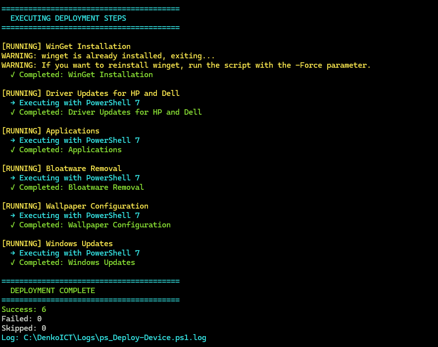

# Windows 11 Pro Deployment Automatisering

<p align="left">
    <a href="README.md">
        
    </a>
</p>

[](https://github.com/Stensel8/DenkoICT/actions/workflows/dependabot/dependabot-updates)

[](https://github.com/Stensel8/DenkoICT/actions/workflows/devskim.yml)

[](https://github.com/Stensel8/DenkoICT/actions/workflows/powershell.yml)

Geautomatiseerde Windows 11 Pro deployment die daadwerkelijk werkt. Geen MDT, geen VBScript, geen handmatig klikken. Gebruikt PowerShell 2.0 in WinPE, PowerShell 5.1 om PowerShell 7 op te starten, en vervolgens PowerShell 7 voor de daadwerkelijke deployment. Moderne tools waar mogelijk.




## Wat Je Krijgt

- Zero-touch Windows 11 deployment via USB boot
- Automatische driver updates (Dell DCU-CLI, HP CMSL)
- WinGet applicatie deployment met retry logic
- Registry-based progress tracking die crashes overleeft
- Deployment gaat door wanneer individuele stappen falen
- RMM agent installatie (Datto, etc.)

## Snelle Start

**Vereisten:** Windows 11 Pro 25H2, **Ethernet verbinding** (vereist voor script downloads)

1. **Maak bootable USB:**
   - **Optie A:** [Windows Media Creation Tool](https://www.microsoft.com/software-download/windows11) (aanbevolen)
   - **Optie B:** [Rufus](https://rufus.ie/) - **Vink de laatste customization boxes niet aan** omdat ze onze `autounattend.xml` zullen overschrijven
   - **Beste resultaten:** Gebruik een schone Windows 11 Pro 25H2 image
   - **Optioneel:** Pre-load RST/RAID drivers in boot.wim om ervoor te zorgen dat alle drives beschikbaar zijn
2. **Kopieer files naar USB root:**
   - `autounattend.xml` 
   - Je RMM agent (noem het `Agent.exe` voor de beste resultaten)
3. **Boot target device vanaf USB** met Ethernet kabel aangesloten
4. **Wacht** - Alles gebeurt automatisch
5. **USB removal timing:**
   - **Houd USB aangesloten** tijdens de eerste reboot (hostname change)
   - **Safe to remove** na 2+ reboots wanneer de progress >64% toont (black screen phase)
   - **Als er geen RMM agent is:** USB kan op elk moment na de eerste reboot worden verwijderd

Zonder Ethernet gebeurt alleen de basis Windows install met hostname change.

## Hoe Het Werkt

**PowerShell Evolutie:**
- **Windows PE**: PowerShell 2.0 tijdens setup (binnen autounattend.xml)
- **First Boot**: PowerShell 5.1 download en installeert PowerShell 7  
- **Deployment**: PowerShell 7 voert alle deployment scripts uit

1. `autounattend.xml` configureert Windows, kopieert RMM agent van USB naar `C:\DenkoICT\Download\Agent.exe`
2. Hostname verandert naar `PC-{SerialNumber}`, systeem reboot  
3. `ps_Init-Deployment.ps1` wordt uitgevoerd bij de eerste login (PowerShell 5.1)
4. Installeert WinGet en PowerShell 7, en start vervolgens `ps_Deploy-Device.ps1`
5. Elke deployment step wordt gevolgd in `HKLM:\SOFTWARE\DenkoICT\Deployment\Steps`

**Steps executed:**
- WinGet installatie
- Driver updates (vendor-specific tools)
- Application bundle via WinGet
- Bloatware removal
- Windows Updates
- RMM agent installatie

Als er iets mislukt, gaat de deployment door. Check `C:\DenkoICT\Logs` voor detailed status en registry voor summary.

## Key Scripts

| Script | Wat Het Doet |
| --- | --- |
| [ps_Init-Deployment.ps1](Scripts/ps_Init-Deployment.ps1) | **Bootstrapper** - Installeert WinGet + PS7, start de main deployment |
| [ps_Deploy-Device.ps1](Scripts/ps_Deploy-Device.ps1) | Main orchestrator - voert alles uit in PowerShell 7 |
| [ps_Custom-Functions.ps1](Scripts/ps_Custom-Functions.ps1) | Function library - logging, network tests, exit codes |
| [ps_Install-Winget.ps1](Scripts/ps_Install-Winget.ps1) | Installeert WinGet met fallback methods |
| [ps_Install-Applications.ps1](Scripts/ps_Install-Applications.ps1) | WinGet app deployment |
| [ps_Install-Drivers.ps1](Scripts/ps_Install-Drivers.ps1) | Dell DCU-CLI / HP CMSL driver updates |

## Gebruik Voorbeelden

**Deploy everything:**
```powershell
.\ps_Init-Deployment.ps1
```

**Installeer specifieke apps (na initialization):**
```powershell
.\ps_Install-Applications.ps1 -Applications @("Microsoft.PowerShell", "7zip.7zip")
```


## RMM Setup

Plaats je RMM agent installer op de USB drive. **Noem het `Agent.exe`** voor zero hassle. 

Tijdens Windows setup zoekt `autounattend.xml` naar files die matchen met `*Agent*.exe`, `*RMM*.exe`, etc., en kopieert de eerste die gevonden wordt naar `C:\DenkoICT\Download\Agent.exe`. Na reboot installeert het deployment script het automatisch.

**Supported agents:** Alles met silent install support (`/S` parameter). Getest met Datto RMM en KaseyaOne.

**Requirements:** RMM agent moet silent/unattended installation ondersteunen.

## Deployment Tracking & Troubleshooting

**Status tracking:**
- Progress opgeslagen in `HKLM:\SOFTWARE\DenkoICT\Deployment\Steps` met timestamps en exit codes
- Elke step wordt vastgelegd met success/failure status
- Registry entries overleven crashes en reboots

**Troubleshooting resources:**
- **Logs directory:** `C:\DenkoICT\Logs\`
- **Common issues:**
    - Network connectivity
    - Windows Update service draait niet
    - USB te vroeg removed tijdens setup

**Common fixes:**
- Network issues: Verhoog retry count in `ps_Deploy-Device.ps1`
- WinGet faalt: Check Windows versie, run `.\ps_Install-Winget.ps1` handmatig
- Driver issues: Verifieer Dell DCU-CLI of HP IA installation en run ze handmatig.
    - HP: C:\SWSetup\
    - Dell: C:\Program Files\Dell\CommandUpdate

## Licentie
Ik bouw dit project onder de [MIT Licentie](LICENSE)

## Credits
Gebouwd met inspiratie van:
- [stensel8](https://github.com/stensel8)
- [realsdeals/](https://github.com/realsdeals/)  
- [jeffdfield](https://github.com/jeffdfield)
- [ChrisTitusTech/winutil](https://github.com/ChrisTitusTech/winutil)
- [asheroto/winget-install](https://github.com/asheroto/winget-install)  
- [FriendsOfMDT/PSD](https://github.com/FriendsOfMDT/PSD)
- [KelvinTegelaar/RunAsUser](https://github.com/KelvinTegelaar/RunAsUser)
- [Raphire/Win11Debloat](https://github.com/Raphire/Win11Debloat)
- [Romanitho/Winget-Install](https://github.com/Romanitho/Winget-Install)
- [omaha-consulting/winstall](https://github.com/omaha-consulting/winstall)
- [omaha-consulting/winget.pro](https://github.com/omaha-consulting/winget.pro)
- [REALSDEALS/pcHealth](https://github.com/REALSDEALS/pcHealth)
- [REALSDEALS/pcHealthPlus-VS](https://github.com/REALSDEALS/pcHealthPlus-VS)
- [REALSDEALS/pcHealthPlus](https://github.com/REALSDEALS/pcHealthPlus)


- [https://github.com/stensel8/pchealth](https://github.com/stensel8/pchealth)
- [https://github.com/realsdeals/](https://github.com/realsdeals/)
- [https://github.com/jeffdfield](https://github.com/jeffdfield)
- [https://github.com/FriendsOfMDT/PSD](https://github.com/FriendsOfMDT/PSD)
- [https://github.com/ChrisTitusTech/winutil](https://github.com/ChrisTitusTech/winutil)
- [https://github.com/KelvinTegelaar/RunAsUser](https://github.com/KelvinTegelaar/RunAsUser)

### Aanvullende referenties
- [https://www.smartdeploy.com/download/trial-guide/](https://www.smartdeploy.com/download/trial-guide/)
- [https://docs.microsoft.com/en-us/windows/deployment/windows-deployment-scenarios](https://docs.microsoft.com/en-us/windows/deployment/windows-deployment-scenarios)
- [https://github.com/FriendsOfMDT/PSD](https://github.com/FriendsOfMDT/PSD)
- [https://learn.microsoft.com/en-us/intune/configmgr/mdt/](https://learn.microsoft.com/en-us/intune/configmgr/mdt/)
- [https://www.microsoft.com/en-us/download/details.aspx?id=54259](https://www.microsoft.com/en-us/download/details.aspx?id=54259)
- [https://github.com/Stensel8/Intune-Deployment-Tool](https://github.com/Stensel8/Intune-Deployment-Tool)
- [https://github.com/rink-turksma/IntunePrepTool](https://github.com/rink-turksma/IntunePrepTool)
- [https://uupdump.net/](https://uupdump.net/)
- [https://2pintsoftware.com/products/deployr](https://2pintsoftware.com/products/deployr)
- [https://www.immy.bot/](https://www.immy.bot/)
- [https://github.com/Romanitho/Winget-Install](https://github.com/Romanitho/Winget-Install)
- [https://github.com/ChrisTitusTech/winutil](https://github.com/ChrisTitusTech/winutil)
- [https://api.github.com/repos/microsoft/winget-cli/releases/latest](https://api.github.com/repos/microsoft/winget-cli/releases/latest)
- [https://github.com/KelvinTegelaar/RunAsUser](https://github.com/KelvinTegelaar/RunAsUser)
- [https://github.com/asheroto/winget-install](https://github.com/asheroto/winget-install)
- [https://www.powershellgallery.com/packages/winget-install/](https://www.powershellgallery.com/packages/winget-install/)
- [https://www.powershellgallery.com/packages/HPCMSL/](https://www.powershellgallery.com/packages/HPCMSL/)
- [https://github.com/omaha-consulting/winstall](https://github.com/omaha-consulting/winstall)
- [https://github.com/omaha-consulting/winget.pro](https://github.com/omaha-consulting/winget.pro)
- [https://github.com/REALSDEALS/pcHealth](https://github.com/REALSDEALS/pcHealth)
- [https://github.com/REALSDEALS/pcHealthPlus-VS](https://github.com/REALSDEALS/pcHealthPlus-VS)
- [https://github.com/REALSDEALS/pcHealthPlus](https://github.com/REALSDEALS/pcHealthPlus)
- [https://github.com/Raphire/Win11Debloat/tree/master](https://github.com/Raphire/Win11Debloat/tree/master)


### Microsoft-ecosysteempartners
- [https://learn.robopack.com/home](https://learn.robopack.com/home)
- [https://www.rimo3.com/ms-intune-migration](https://www.rimo3.com/ms-intune-migration)
- [https://winstall.app/](https://winstall.app/)
- [https://winget.pro/](https://winget.pro/)
- [https://github.com/microsoft/winget-cli/blob/master/doc/windows/package-manager/winget/returnCodes.md](https://github.com/microsoft/winget-cli/blob/master/doc/windows/package-manager/winget/returnCodes.md)
